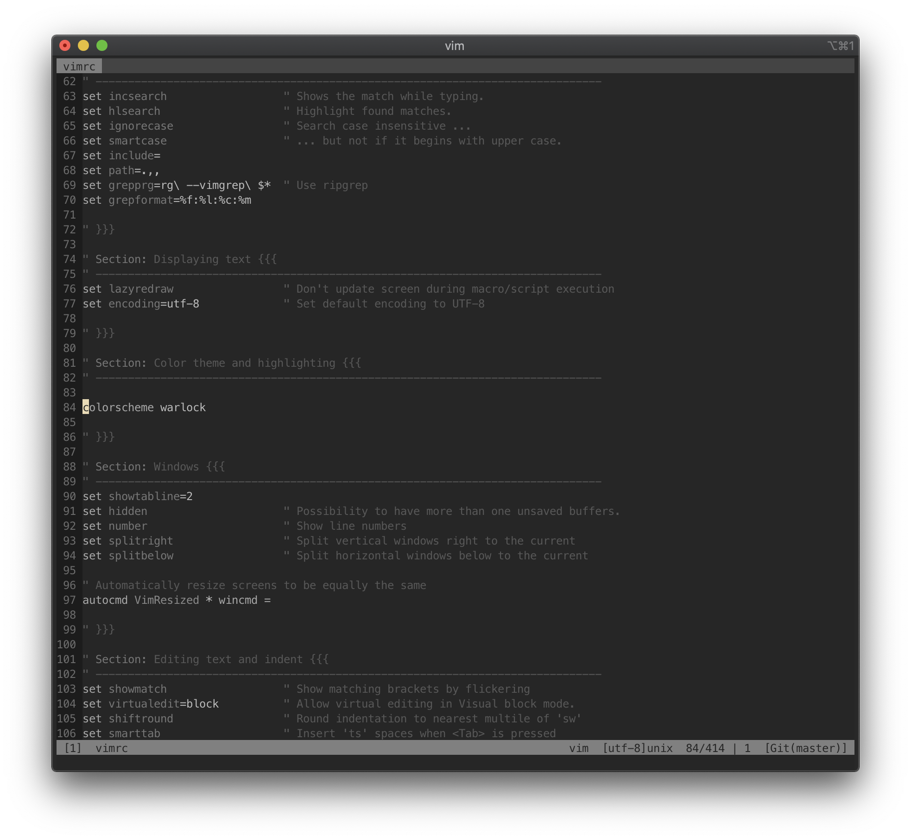
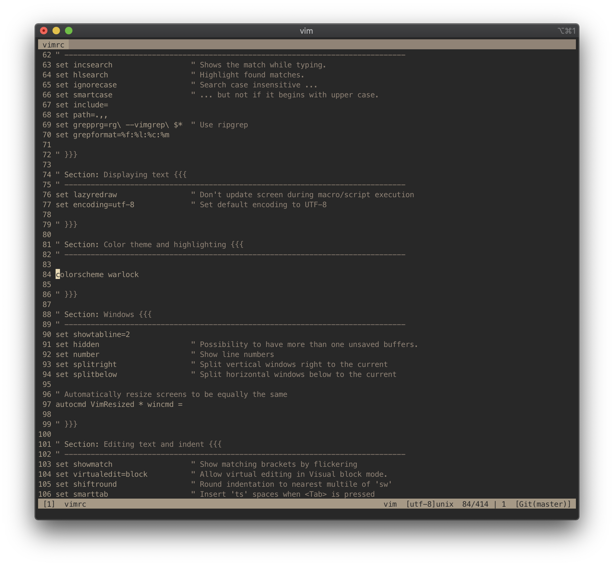

# Warlock

Warlock is a dark, low-contrast, grayscale colorscheme for Vim based on the
awesome [Apprentice](https://github.com/romainl/Apprentice) by Romain Lafourcade.

Some code:

Some code in iTerm, `TERM=xterm-256color`:

Some code in iTerm, `TERM=xterm`, using the Gruvbox color palette:

